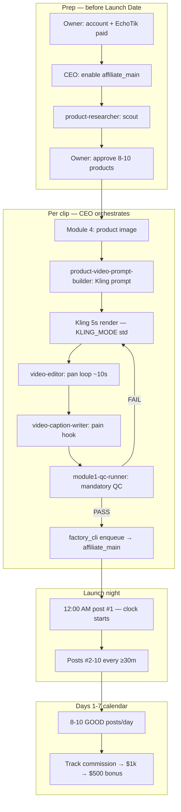
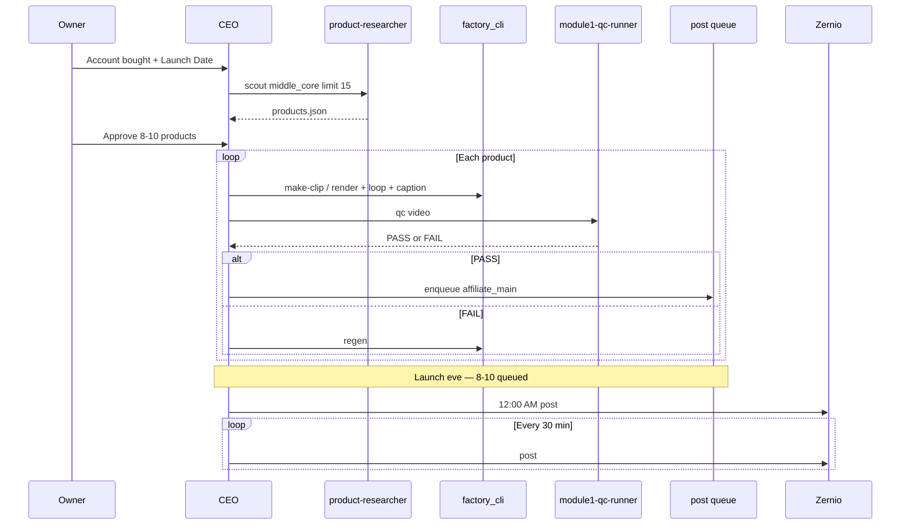

# Pipeline system design

**Purpose:** Exact flow for affiliate clips, CEO ↔ employee orchestration, and posting.  
**Creative rules:** course only — `data/research/course/KNOWLEDGE.md`  
**Launch timing:** `docs/LAUNCH_TODO.md`

---

## Machines

| Machine | Role |
|---------|------|
| **Cursor cloud VM** | CEO + employees; scout, Kling, QC, Zernio post, queue |
| **Owner HP (WSL)** | Bubble hub later; optional SSH for agent terminal |
| **Phones (×4)** | Bubble Mackenzie finish only — not affiliate launch blocker |

---

## Affiliate clip pipeline (one product)



---

## CEO orchestration (required pattern)

**You are the CEO.** Subagents do not see this chat. Every dispatch must include: mission id, paths, product name, caption, account id `affiliate_main`.

### 1. Start mission

```bash
MISSION=$(python3 -m shorts_bot.agent_ops mission new --name "Launch batch PRODUCT")
```

### 2. Log every dispatch

```bash
python3 -m shorts_bot.agent_ops log --mission "$MISSION" --agent ceo --event dispatch_background \
  --target AGENT_NAME --message "why"
```

### 3. Parallel work (use Task tool)

| Step | Employee | Background? | When |
|------|----------|-------------|------|
| Scout / briefing | `product-researcher` or `knowledge-gatherer` | Yes | Prep, research questions |
| Video prompt | `product-video-prompt-builder` | No | After Module 4 image |
| Caption | `video-caption-writer` | No | Can parallel with editor after Kling |
| Pan loop + burn | `video-editor` | Yes | After Kling raw MP4 |
| QC | `module1-qc-runner` | Yes | Before enqueue — **block upload on fail** |

### 4. Mechanical steps (CEO runs on VM — do not delegate to wrong agent)

```bash
# Scout
python3 -m shorts_bot.tiktok_shop.scout_cli run --preset middle_core --limit 15

# Full mechanical clip (after prompt + image ready)
python3 -m shorts_bot.tiktok_shop.factory_cli make-clip --product "NAME"

# QC (employee can run same command)
python3 -m shorts_bot.tiktok_shop.factory_cli qc --video PATH --product "NAME" --caption "..." --account affiliate_main

# Queue
python3 -m shorts_bot.tiktok_shop.factory_cli enqueue --video PATH --product "NAME" --caption "..." --account affiliate_main

# Launch night — ONE at a time, ≥30m apart
python3 -m shorts_bot.tiktok_shop.factory_cli post --account affiliate_main --confirm
```

---

## Launch batch pipeline (8–10 clips)



---

## Module map (course → automation)

| Module | Course file | Employee / code |
|--------|-------------|-----------------|
| 1 Rules | `module_01` | `module1-qc-runner` · `module1_qc.py` |
| 3 Research | `module_03` · `PRODUCT_RESEARCH.md` | `product-researcher` · `scout_cli` |
| 4 Image | `module_04` · `PROMPT_BUILDER.md` | Owner/Higgsfield — not fully automated |
| 5 Video | `module_05` | `product-video-prompt-builder` · `kling_client` |
| 6 Edit | `module_06` · `VIDEO_EDITOR.md` | `video-editor` · `video_variants.py` |
| 7 Violations | `module_07` | QC + caption rules — no sale/price words |
| 8 Appeals | `module_08` · `APPEALS.md` | Manual if flagged |

---

## Posting rules (hard gates)

From Module 1 + launch plan:

- **Zero** Module 1 violations before enqueue/post  
- **≥30 minutes** between posts on same account  
- **8–10 posts/day** cap on `affiliate_main` (`daily_limit: 10`)  
- **Launch:** post #1 **12:00 AM** Launch Date; not `post-batch` for launch night  
- **GOOD** = QC pass + course edit — not raw Kling output  

---

## Bubble wrap pipeline (parallel — later)


Not built: `phone_hub.worker` · carousel inbox automation.

---

## Data files

| Path | Purpose |
|------|---------|
| `data/tiktok_shop/products.json` | Scout picks |
| `data/tiktok_shop/accounts.json` | `affiliate_main` + bubble four |
| `data/tiktok_shop/post_queue.json` | Pending uploads |
| `data/tiktok_shop/post_log.jsonl` | Sent today — spacing + daily cap |
| `data/agent_ops/missions/` | CEO ↔ employee log |

---

## Dead — never pipeline these

Fix It Fast · Rapid Tool Review · Ms. Byte lane · InVideo daily · Peripheral horror

---

## Cursor rules that enforce this design

| Rule file | Applies when |
|-----------|----------------|
| `.cursor/rules/00-core-always.mdc` | Every chat |
| `.cursor/rules/ceo-orchestration.mdc` | CEO delegating / missions |
| `.cursor/rules/affiliate-pipeline-flow.mdc` | Clips, scout, launch |
| `.cursor/rules/tiktok-shop-factory.mdc` | Editing `shorts_bot/tiktok_shop/**` |
| `.cursor/rules/course-creative.mdc` | Editing course knowledge |
| `.cursor/rules/launch-ops.mdc` | Launch / week-1 / midnight |

See https://cursor.com/docs/rules
